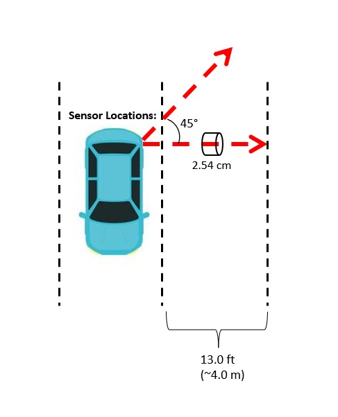
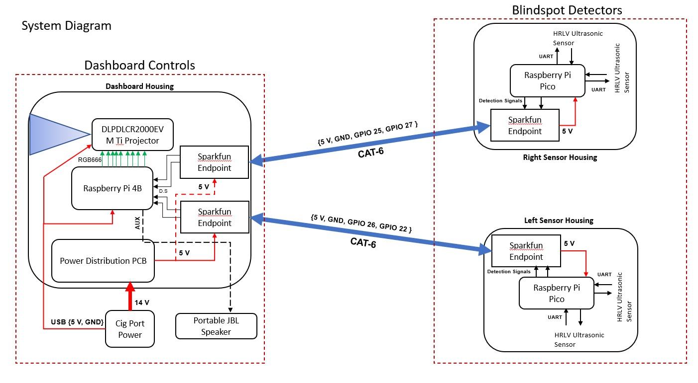
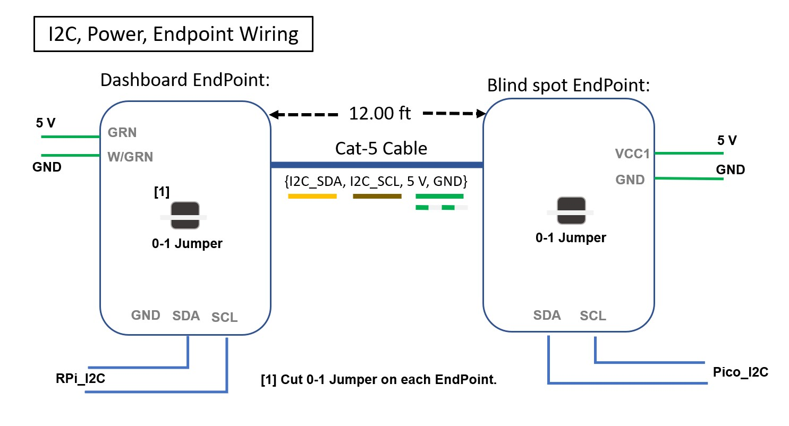
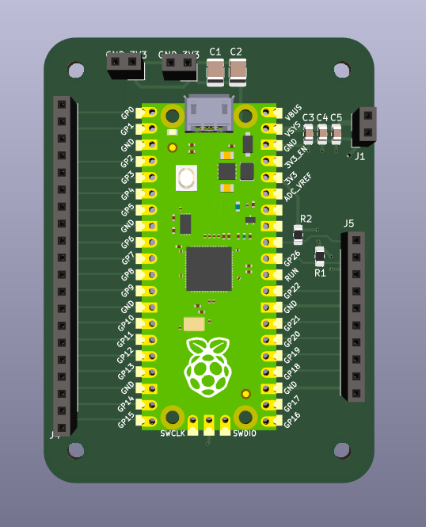

# Blindspot Detection and Heads up Display

## Description:

Project code and CAD files for an after-market vehical blind-spot detection system and driver attentiveness.

## Hardware:

- Raspberry Pi 4b
- Raspberry Pi Pico
- Ultrasonic sensors

## Features:

- Ultrasonic sensors actively montior both rear vehicle blindspots
- GUI designed using PyQT, informing drivers in real-time of detections
- External speaker capable of providing audio alerts for the driver
- Active driver facial and eye tracking, keep track of when the driver loses focus on the road

## Photos:

#### Rear-mounted ultrasonic sensor locations:

#### Complete System diagram:

#### Raspberry Pi to Microcontroller communication diagram:

#### Microcontroller PCB 3D model

## License

This project is open source, feel free to use any of the files in your own project.
